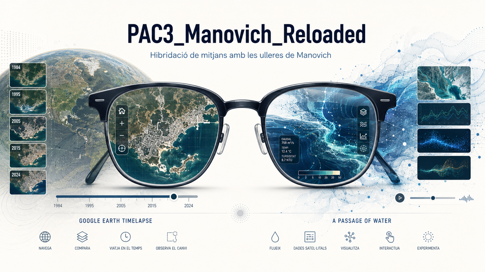
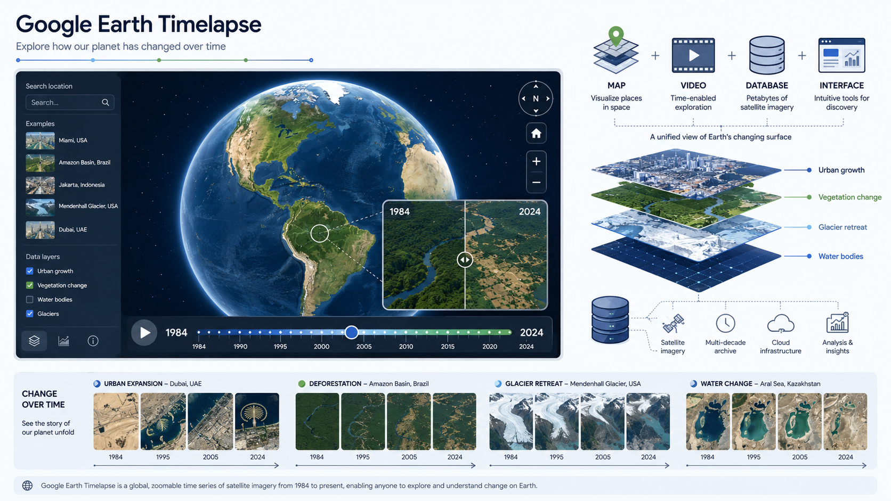
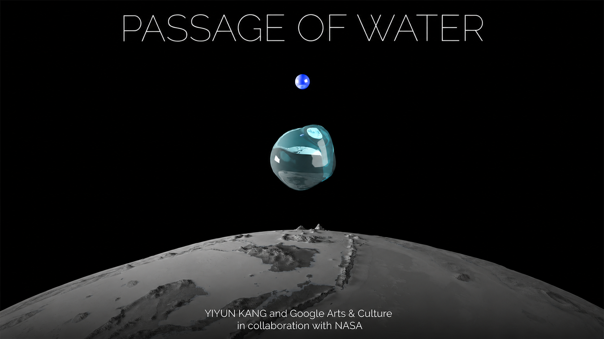
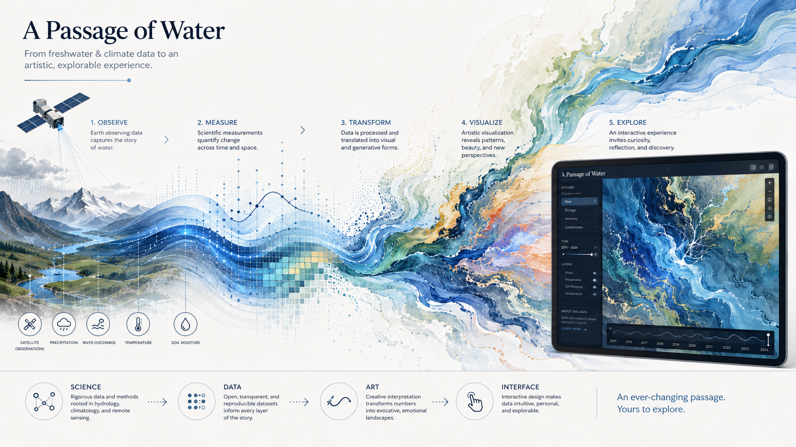

# PAC3 Manovich Reloaded

## Assaig de dos casos recents d’hibridació de mitjans des de la perspectiva de Lev Manovich

**Autor:** Joan Arenas Martínez

**Data:** 15 de Maig de 2026

**Assignatura:** 20.444 - Cultura Digital 

**UOC - Grau Multimèdia**

**Llicència:** Creative Commons 1.0 Universal

---

## Introducció

Lev Manovich planteja en el seu llibre *El software toma el mando* que l’ordinador no és només una eina tècnica, sinó que també és un **metamedi** capaç de contenir, transformar i combinar mitjans anteriors i mitjans informàtics. Aquesta idea és molt útil per analitzar diferents experiències digitals actuals com les que es detallen a continuació, ja que moltes vegades no podem classificar-les només com a vídeo, mapa, base de dades, animació, narració o visualització científica. Amb el que ens trobem és amb objectes culturals híbrids en què el programari utilitza diferents tècniques de representació, manipulació i interacció.

Si mirem els casos seleccionats en aquesta PAC amb les “ulleres de Manovich”, ens adonem que, més enllà d’identificar quins formats apareixen en cada projecte, el que és més interessant és analitzar com aquests formats es transformen quan entren en un entorn de programari. Un producte **multimèdia** pot incloure text, imatge, so i vídeo, però aquests elements poden continuar funcionant com a peces independents. En canvi, quan parlem d'**hibridació** ens referim a una integració més profunda, en què les propietats i tècniques de diferents mitjans es fusionen per a generar una experiència nova i coherent. Aquesta és la diferència clau entre **multimèdia** i **hibridació** (Manovich, 2013; Adell Español, 2024).

Açò també es relaciona amb el concepte de *deep remixability* que Manovich desenvolupa a *Understanding Hybrid Media*. Segons Manovich, la cultura digital remescla continguts procedents de diferents mitjans, però també fusiona tècniques i formes de representació que fins ara havien pertangut a disciplines separades com la cartografia, el cinema, l’animació, la fotografia, la visualització de dades o el disseny d’interfícies (Manovich, 2007).

Els dos casos que he elegit són **Google Earth Timelapse** i **A Passage of Water**. El motiu pel qual els he seleccionat és perquè tots dos parteixen de dades científiques i geogràfiques complexes, però no presenten aquestes dades com una informació estàtica. En aquests casos, el programari transforma les dades en experiències visuals i interactives. En el cas de **Google Earth Timelapse**, el programari fa que el planeta es converteisca en un mapa temporal que es pot navegar i en el cas de **A Passage of Water**, les dades recopilades sobre l’aigua dolça es transformen en una experiència artística i narrativa.

---

## Cas 1: Google Earth Timelapse

**Enllaç a la web:** [Google Earth Timelapse](https://earthengine.google.com/timelapse/)  

**Recursos complementaris:**

[Timelapse in Google Earth - Google Blog](https://blog.google/products-and-platforms/products/earth/timelapse-in-google-earth/) 

[Vídeo - Exploring Timelapse in Google Earth](https://www.youtube.com/watch?v=5W-zPqrGQWA)

[Timelapses descarregables de diferents parts del món en format vídeo](https://developers.google.com/earth-engine/timelapse/videos)

**Google Earth Timelapse** és un projecte interactiu en la que es pot observar en un entorn navegable l’evolució de la superfície terrestre des de 1984 fins a l’actualitat mitjançant imatges satel·litals processades. Aquest projecte ens dona l'oportunitat de veure transformacions com la desforestació, el creixement urbà, l’expansió agrícola, el retrocés de glaceres o els canvis en les costes. El seu valor es troba en la manera en com es mostra aquest contingut, és a dir, en com aquesta quantitat d'informació de les imatges satel·litals es converteix en una experiència visual i interactiva.

Podem dir que el cas parteix del mapa, un mitjà molt antic que, tradicionalment, ha estat una representació fixa del territori, vinculada a una escala i a un moment determinat. Google Earth ja va remeiar fa temps aquest objecte per convertir-lo en una interfície digital navegable on, per representar el planeta, es combinen la fotografia aèria, les imatges satel·litals, el modelatge 3D i les dades geogràfiques. **Google Earth Timelapse** afegeix a açò una capa especialment significativa: el temps. Amb aquest programari, el planeta Terra és una superfície que podem recórrer, però també passa a ser un procés que podem observar.

**Timelapse** és un bon exemple d'hibridació perquè no és simplement un producte multimèdia. No es limita a col·locar vídeos, imatges i textos al voltant d’un mapa, sinó que fusiona procediments i pràctiques pròpies de la cartografia, la fotografia satel·lital, les base de dades, el vídeo, la visualització científica i la navegació interactiva. L'usuari pot decidir on mirar i a quina escala i elegir el canvi territorial a observar en lloc de contemplar una seqüència fixa com faria al veure un documental lineal.

Com exposa Manovich, quan les tècniques de diferents mitjans es converteixen en elements de programari combinables és quan els mitjans digitals híbrids apareixen i aquest és un bon exemple d'aquesta idea. En **Google Earth Timelapse**, les imatges satel·litals són dades georeferenciades, ordenades temporalment i integrades en un sistema de visualització, no sols fotografies. El vídeo tampoc funciona com un vídeo convencional, ja que no té un únic enquadrament ni un recorregut fixe. I el mapa, a l'incorporar moviment, zoom, temporalitat i exploració, deixa de ser també un simple mapa.

Per altra banda, també és molt rellevant el paper dels algoritmes, perquè per poder fer possible aquesta experiència, les imatges han d’haver estat seleccionades, processades, alineades i convertides en una visualització contínua. El programari és l'encarregat de transformar la gran massa de dades disperses en una representació fluida i accessible i així invisibilitzar la complexitat tècnica darrere d’una interfície intuïtiva. És precisament aquesta capa algorítmica l'element que permet transformar les dades en una experiència visual i interactiva i fa possible una nova manera de representar i explorar el planeta.

**Timelapse** és una clara evolució de l’exemple de Google Earth que apareix en les explicacions sobre hibridació. Si Google Earth ja es podia entendre com una representació híbrida del planeta, **Timelapse** porta aquesta lògica un pas més enllà, ja que permet navegar per l'espai i, a més, pel temps. És un cas que podria aparéixer perfectament com un exemple d’hibridació entre mapa, vídeo, arxiu, bases de dades i interfície en una hipotètica segona versió d’*El software toma el mando*.

  

---

## Cas 2: A Passage of Water

**Enllaç a la web:** [A Passage of Water - Google Arts & Culture](https://artsandculture.google.com/experiment/passage-of-water/dAElpEyEjuE9XQ?hl=en)  

**Recursos complementaris:**

[Article: Google’s “A Passage of Water” Brings NASA’s Water Data to Life](https://swot.jpl.nasa.gov/news/112/googles-a-passage-of-water-brings-nasas-water-data-to-life/)  

[Entrevista/explicació de l’artista](https://artsandculture.google.com/story/passage-of-water-by-dr-yiyun-kang/EAXxyKElbH3uTw?hl=en)

*A Passage of Water* és una experiència interactiva de Google Arts & Culture creada en col·laboració amb la NASA i l’artista Yiyun Kang. El projecte tracta sobre la disponibilitat d’aigua dolça i la crisi hídrica global, i fa ús de dades de les missions satel·litals GRACE i SWOT. *A Passage of Water* no presenta les dades com ho faria un informe científic tradicional, en lloc d'això, les transforma en una experiència visual, narrativa i interactiva.

Aquest projecte és un exemple clar d’hibridació perquè està situat en un punt intermedi entre ciència, l'art digital, la divulgació i el disseny d’interfícies. Les dades sobre l’aigua dolça, que es podrien representar simplement mitjançant gràfics, taules o mapes tècnics, ací es converteixen en formes visuals, transicions i recorreguts interactius. D'aquesta manera la informació científica canvia de llenguatge. El programari fa possible convertir dades complexes en una experiència visual i interactiva, més semblant a la contemplació artística i a la narrativa ambiental que a llegir un document tècnic.

Si ens posem les “ulleres de Manovich”, aquest és un cas que mostra que la hibridació no consisteix únicament a reunir diferents formats com el text, la imatge, el so i l'animació i col·locar-los en una mateixa web. En *A Passage of Water* el que es produeix és una fusió entre tècniques de visualització de dades, llenguatges artístics, recursos audiovisuals, estructura narrativa i interacció. Les dades científiques són la matèria primera, però el resultat final és una experiència cultural. En aquest projecte es mesclen mètodes de treball que venen de diferents camps (investigació climàtica, teledetecció, disseny visual, art digital i comunicació interactiva), per tant, aquesta transformació encaixa també amb el concepte de *deep remixability*.

També pot relacionar-se aquest cas amb les tècniques de programari descrites per Manovich. Per una banda, s'utilitzen tècniques específiques del tractament de dades científiques i geoespacials. Per altra banda, el projecte inclou tècniques independents del mitjà, com ara la navegació interactiva, la superposició de capes visuals, l’animació, la transició entre escenes o l’organització hipertextual. La incorporació d'aquestes tècniques és la que fa possible que dades, imatges, text i moviment compartisquen un mateix entorn de visualització.

El paper de l'usuari també és un aspecte important. En un documental tradicional sobre la crisi de l’aigua, l’usuari seguiria un recorregut lineal marcat prèviament pel muntatge. En canvi, en *A Passage of Water* la interfície ens convida a avançar, a explorar i a establir una relació més activa amb la informació. En aquest cas, la pantalla funciona a la vegada com un lloc de visualització de dades, un espai narratiu i un entorn d’exploració.

Aquest projecte és un bon exemple de com el programari pot canviar la manera de comunicar problemes globals. La crisi de l’aigua és un fenomen que, per la seua complexitat, és difícil de percebre de manera directa perquè implica escales temporals, geogràfiques i científiques molt àmplies. *A Passage of Water* aconsegueix transmetre aquesta complexitat mitjançant una experiència visual que fa que les dades siguen més accessibles emocionalment i culturalment. Per tot açò, pot considerar-se com un cas recent i rellevant d’hibridació entre ciència, art, dades i programari. El seu punt fort està a transformar un conjunt de mesures i dades complexes que són difícilment visibles en una experiència que es pot recórrer i interpretar d'una manera dinàmica i intuïtiva.

---

## Conclusió

Aquests dos casos que hem analitzat mostren com el concepte d'**hibridació** continua sent molt útil per comprendre la cultura digital actual. *Google Earth Timelapse* i *A Passage of Water* parteixen de dades complexes que són transformades en experiències accessibles mitjançant interfícies visuals i interactives. En els dos casos el programari és l’element que fa possible la combinació entre mitjans, dades, tècniques i formes de navegació.

També he volgut seleccionar dos exemples vinculats a problemàtiques ambientals per a mostrar que, més enllà d'una qüestió estètica, la **hibridació** pot ser també una forma de coneixement i de sensibilització. El mapa temporal de Google Earth Timelapse i la narrativa visual d’*A Passage of Water* fan més fàcil comprendre fenòmens globals gràcies a una experiència més directa i interactiva.

Per acabar, gràcies a l'ús d'eines com Markdown i a la publicació en un repositori de GitHub sota una llicència Creative Commons que permet compartir, revisar i reutilitzar, aquest assaig s'ha pogut desenvolupar dins d'una lògica de cultura oberta. Aquesta manera de treballar està íntimament relacionada amb la cultura participativa i amb el pensament que el coneixement digital pot construir-se de manera oberta, documentada i reutilitzable (Gea Megías, 2022; McMillan, 2012).

---

## Bibliografia i referències

Manovich, L. (2013). *El software toma el mando*. Editorial UOC.

Manovich, L. (2007). *Understanding Hybrid Media*. http://manovich.net/content/04-projects/055-understanding-hybrid-media/52_article_2007.pdf

McMillan, R. (2012). *Lord of the Files: How GitHub Tamed Free Software*. *Wired*.

Adell Español, F. (2024). *Fonaments i evolució de la multimèdia*. Universitat Oberta de Catalunya.

Gea Megías, M. (2022). *Herramientas y metodología crowdsourcing para la participación y creación colectiva de conocimiento abierto*. Universidad de Granada. https://mgea.github.io/CCpapers/#/MetodologiaCrowdsourcing/

Google Earth Engine. (s. d.). *Timelapse*. https://earthengine.google.com/timelapse/

Google. (2021). *Time flies in Google Earth’s biggest update in years*. Google Blog. https://blog.google/products-and-platforms/products/earth/timelapse-in-google-earth/

Google. (2023). *See the planet change with new imagery in Google Earth Timelapse*. Google Blog. https://blog.google/products-and-platforms/products/earth/new-imagery-google-earth-timelapse-videos/

Google Arts & Culture. (2024). *A Passage of Water*. https://artsandculture.google.com/experiment/passage-of-water/dAElpEyEjuE9XQ?hl=en

Google Arts & Culture. (2024). *Passage of Water by Dr Yiyun Kang*. https://artsandculture.google.com/story/passage-of-water-by-dr-yiyun-kang/EAXxyKElbH3uTw?hl=en

NASA/JPL. (2023). *Google’s “A Passage of Water” Brings NASA’s Water Data to Life*. https://swot.jpl.nasa.gov/news/112/googles-a-passage-of-water-brings-nasas-water-data-to-life/

OpenAI. (2026). *ChatGPT (GPT-5.5 Thinking) [Model de llenguatge]*. Utilitzat com a suport per a la delimitació del tema, revisió lingüística i orientació documental.

